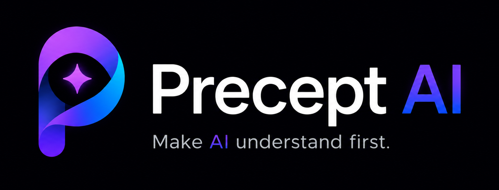

# Precept AI



**The guardrail that stops your AI agent from breaking your codebase.**

AI agents write code faster than ever — and break prod faster than ever. Precept is the checkpoint they hit _before_ writing a line: it tells them what your team already decided, what they're about to break, and when to stop.

<p align="center">
  
</p>

[](LICENSE)
[](https://www.python.org/downloads/)

---

## The problem

Coding agents (Claude Code, Cursor, Copilot, Hermes…) are getting more autonomous every month. That's great — until one confidently duplicates a service your team already wrote, ignores a rule it agreed on six months ago, and ships it.

More autonomy means more speed _and_ more blast radius. Precept is the seatbelt.

## What it does

Precept sits between your AI agent and your repo over MCP. Before the agent writes code, it must ask Precept — and gets back this:

```text
Request:   "add Google SSO to /login"
Domain:    auth (HIGH)
Decision:  ASK — human confirmation required
Reuse:     AuthService, SessionStore  (don't recreate)
Team rule: "Sessions live server-side — never localStorage" (alice, approved)
Risk:      auth → session → audit log
```

**Before Precept:** the agent rolls a fresh OAuth flow, drops tokens in `localStorage`, ships it. You catch it in review — or after a breach.

**After Precept:** the agent reuses `AuthService`, follows the team rule, and pauses on the HIGH-risk change until a human approves. AI-written knowledge lands as **Pending** until a human approves it on the dashboard.

<p align="center">
  
</p>

---

## "Just put it in CLAUDE.md / docs/"

Docs are passive. The agent reads them only if it remembers to, and only the slice that fits in its context window. Same repo, same prompt, two setups:

Same prompt. Same repo. Two terminals.

<table>
<tr>
<th>❌ Without Precept</th>
<th>✅ With Precept</th>
</tr>
<tr>
<td valign="top">

```text
$ claude "add Google SSO to /login"

⚙ Reading repo...
✓ Created auth/sso/google.ts
✓ Created OAuthClient.ts
✓ Stored access_token in localStorage
✓ Committed: feat(auth): Google SSO


─ 2 days later, in PR review ─

reviewer: "We already have AuthService —
           why a new OAuthClient?"
reviewer: "Tokens in localStorage??
           that breaks our session policy."

→ Revert. Rewrite. Re-review.
```

</td>
<td valign="top">

```text
$ claude /precept "add Google SSO to /login"

⚙ analyze_intent...

┌──────────────────────────────────┐
│ Domain:   auth (HIGH)            │
│ Decision: ASK                    │
│ Reuse:    AuthService,           │
│           SessionStore           │
│ Rule:     "Sessions live         │
│            server-side — never   │
│            localStorage"         │
│            (alice, approved)     │
│ Risk:     auth → session →       │
│           audit log              │
└──────────────────────────────────┘

⏸ Pausing for human sign-off.
```

</td>
</tr>
</table>

If the agent ever tries to push past `ASK`, the pre-commit hook and the CI cognition gate reject the merge — so the wrong path on the left literally can't ship.

|                               | `CLAUDE.md` / wiki / RAG           | Precept                         |
| ----------------------------- | ---------------------------------- | ------------------------------- |
| Consulted before code         | Optional — if the agent samples it | Mandatory MCP call              |
| Knows the blast radius        | Static prose                       | Graph traversal in real time    |
| Returns a verdict             | Facts only                         | `proceed / warn / ask / reject` |
| Enforceable in CI             | CI can't parse "remember to…"      | Exit codes `0 / 1 / 2`          |
| Tracks who approved each rule | Anyone edits the file              | Approval queue + audit log      |

> Precept doesn't replace your agent or your docs — it's the **mandatory checkpoint** between them and prod. More agent autonomy makes Precept _more_ valuable, not less.

### What makes it different

- **Mandatory, not optional** — the agent must call `analyze_intent` before any code change, not "if it remembers to." RAG and wikis are a library; Precept is a checkpoint.
- **A decision, not a document** — a rule-based `proceed / warn / ask / reject`, computed with no LLM (deterministic, free, no API key).
- **Knows the blast radius** — reusable assets, affected domains, and cascade risk pulled straight from your repo's cognitive graph (domain × asset × convention × impact).
- **Team decisions are binding** — approved decisions + an approval queue + audit. AI can make a call _stricter_, never silently looser.

### Where it shines

- ✅ Real codebases with team conventions — auth, webhook, order/state machines, money logic, multi-repo products
- ➖ Greenfield throwaways and one-shot scripts with no team context

**It gets cheaper the more you use it** — reuses approved decisions instead of re-deriving them every session, kills the rejected-then-rewritten token churn, and pulls only the relevant context per request. Seed once with `/precept-generate`, then every `/precept` call starts from real context.

---

## Quickstart

Two commands. The first installs the CLI; the second wires up everything else.

```bash
uv tool install precept-ai          # or: git+https://github.com/qorstack/precept.git
precept quickstart
```

`precept quickstart` scaffolds `.env` + `docker-compose.yml`, starts Postgres + the dashboard, registers the MCP server with Claude Code, and installs the `/precept` slash commands. It's safe to re-run — existing files are left untouched.

Then open Claude Code in any repo and try:

```text
/precept add Google SSO to /login
```

Prefer the terminal? `precept "add Google SSO to /login"` runs the same engine and prints the verdict.

Prefer to wire it up yourself? The manual steps are below.

<details>
<summary><b>Prerequisites</b></summary>

- Docker + Docker Compose v2 (the published image supports `linux/amd64` and `linux/arm64`, so Apple Silicon Macs work natively)
- Python 3.11+ with [`uv`](https://docs.astral.sh/uv/). Install it:
  - macOS / Linux: `curl -LsSf https://astral.sh/uv/install.sh | sh` (or `brew install uv`)
  - Windows: `powershell -ExecutionPolicy ByPass -c "irm https://astral.sh/uv/install.ps1 | iex"`
- ~2GB free RAM

</details>

---

## Enforce it (block risky changes)

Verdicts are advisory until you wire them into your pipeline. Two ways:

**Local — pre-commit hook**

```yaml
# .pre-commit-config.yaml
repos:
  - repo: https://github.com/qorstack/precept
    rev: v0.2.0
    hooks:
      - id: precept-commit-check
        args: [--strict]
```

**CI — gate every PR** (can't be skipped with `--no-verify`):

```bash
printf '%s' "$PR_TITLE" | precept check --strict   # exit 2 = reject · 1 = needs approval · 0 = ok
```

A ready-made GitHub Action ships in [`.github/workflows/cognition-gate.yml`](.github/workflows/cognition-gate.yml) — it evaluates every PR's intent and fails the check when Precept would reject it.

---

## Works with any AI agent (MCP)

Precept is a standard stdio MCP server — the command is always `precept mcp`. Print the exact config for your client:

```bash
precept mcp-config cursor      # or: claude · vscode · windsurf · cline · all
```

| Agent                   | Setup                                                              |
| ----------------------- | ----------------------------------------------------------------- |
| Claude Code             | `claude mcp add precept -- precept mcp` (plus the `/precept` slash command) |
| Cursor                  | add to `~/.cursor/mcp.json`                                        |
| VS Code / Copilot agent | add to `.vscode/mcp.json` (uses a `servers` key)                  |
| Windsurf                | add to `~/.codeium/windsurf/mcp_config.json`                      |
| Cline                   | add to `cline_mcp_settings.json`                                   |

Generic config most clients accept:

```json
{ "mcpServers": { "precept": { "command": "precept", "args": ["mcp"] } } }
```

> The `/precept` slash command is Claude-Code-only. On other agents, Precept's MCP tool instructions steer the agent to consult `analyze_intent` before coding — and for a hard gate that no agent can skip, use the pre-commit / CI enforcement above.

---

## Manual setup

### Part 1 — Dashboard

#### 1. Create `.env`

```env
POSTGRES_USER=precept
POSTGRES_PASSWORD=precept
POSTGRES_DB=precept
POSTGRES_PORT=5432
WEB_PORT=8080
```

#### 2. Create `docker-compose.yml`

```yaml
services:
  postgres:
    image: pgvector/pgvector:pg16
    container_name: precept-postgres
    environment:
      POSTGRES_USER: ${POSTGRES_USER}
      POSTGRES_PASSWORD: ${POSTGRES_PASSWORD}
      POSTGRES_DB: ${POSTGRES_DB}
    ports: ["${POSTGRES_PORT}:5432"]
    volumes: [precept_pgdata:/var/lib/postgresql/data]
    healthcheck:
      test: ["CMD-SHELL", "pg_isready -U $$POSTGRES_USER"]
      interval: 5s

  web:
    image: ghcr.io/qorstack/precept:latest
    container_name: precept-web
    depends_on: { postgres: { condition: service_healthy } }
    environment:
      POSTGRES_USER: ${POSTGRES_USER}
      POSTGRES_PASSWORD: ${POSTGRES_PASSWORD}
      POSTGRES_DB: ${POSTGRES_DB}
      POSTGRES_HOST: postgres
      POSTGRES_PORT: 5432
    ports: ["${WEB_PORT}:8080"]

volumes:
  precept_pgdata:
```

#### 3. Start & open

```bash
docker compose up -d
open http://localhost:8080
```

Use the dashboard to add knowledge entries by hand. Done — or continue to Part 2 for AI integration.

---

### Part 2 — AI integration

#### 4. Install the CLI

Install [`uv`](https://docs.astral.sh/uv/), then the CLI:

On macOS / Linux:

```bash
curl -LsSf https://astral.sh/uv/install.sh | sh && source $HOME/.local/bin/env
uv tool install git+https://github.com/qorstack/precept.git
precept --version
```

On Windows (PowerShell):

```powershell
powershell -ExecutionPolicy ByPass -c "irm https://astral.sh/uv/install.ps1 | iex"
# close & reopen PowerShell so PATH refreshes, then:
uv tool install git+https://github.com/qorstack/precept.git
precept --version
```

> `uv: command not found` after install? Run `source $HOME/.local/bin/env` (mac/Linux) or reopen the terminal (Windows). To make it permanent on mac/Linux: `echo '. "$HOME/.local/bin/env"' >> ~/.zshrc`.

#### 5. Create `precept.config` at each repo root

```toml
workspace = "my-product"
repo_name = "aaa-api"

[database]
host     = "localhost"
port     = 5432
user     = "precept"
password = "precept"
db       = "precept"
schema   = "public"
```

> Or put `[database]` in `~/.precept.config` once and per-repo files only need `workspace` + `repo_name`.

When Claude saves memory via MCP, precept auto-tags it with `scope=workspace`, this `workspace`, and this `repo_name` — entries land in the right bucket on the dashboard without any extra work.

#### 6. Register precept with Claude Code

Need Claude Code first? Install it from [claude.com/claude-code](https://claude.com/claude-code) (`npm install -g @anthropic-ai/claude-code`). Then:

```bash
claude mcp add --scope user precept -- precept mcp
claude mcp list   # should show: precept ✓
```

#### 7. Install the slash commands

```bash
precept install-claude-commands     # copies /precept and /precept-generate to ~/.claude/commands/
```

Two commands ship:

| Command              | Use it when                                                                                                                                                                                                                   |
| -------------------- | ----------------------------------------------------------------------------------------------------------------------------------------------------------------------------------------------------------------------------- |
| `/precept <request>` | **Every feature / refactor / fix.** Forces Claude to run the full pipeline (analyze_intent → recall_context → get_reusable_assets → assess_risk_in_context) and open with a `Risk:` / `Decision:` header before writing code. |
| `/precept-generate`  | **Once, then occasionally.** Have Claude read this repo and seed meaningful memory entries. Safe to re-run after refactors.                                                                                                   |

> Why a slash command? MCP tool descriptions only reach Claude when it _decides_ to use a tool — a plain prompt can slip past the pipeline. `/precept` makes the consult mandatory.

#### 8. Seed memory from the repo (first time or re-generate)

Open Claude inside the repo and run:

```text
/precept-generate
```

Claude will walk the codebase, extract meaningful conventions / decisions / reusable assets, and save them through MCP. Entries land as **Pending** for you to approve on the dashboard.

Re-run after a big refactor or when onboarding a new repo — it's idempotent.

> Add `.precept/` to your repo's `.gitignore`

#### 9. Use it

In Claude, try:

```text
/precept add Google SSO to /login
```

You should see a reply that opens with `Risk: <level> — <why>` / `Decision: ...` and references your stored memory in the `Memory:` line.

If not: `claude mcp list` shows `✗` → run `precept mcp` in a terminal to see the error (usually missing DB credentials).

---

## Dashboard at a glance

- **Home** — two hero cards: ⏳ **Pending review** (AI entries awaiting approval) + 🌐 **Global knowledge**. Plus a per-workspace breakdown.
- **Knowledge** — workspace pills at the top, then filter by source (Human / AI), status (Approved / Pending), or domain. Every row shows scope + source badges.
- **Entry detail** — full metadata strip plus a **Move to Global ↑** / **Move to Workspace ↓** button so you can re-scope without re-creating.
- **Summaries / Activity** — per-domain AI syntheses and full audit log.

---

## Tips — fewer tokens, sharper answers

- **Use `/precept` only for real changes** — features, refactors, bug fixes. Skip it for renames, typos, formatting.
- **Approve memory on the dashboard** — pending entries are not recalled in the next session. Approved ones are.
- **Solo / fast-moving repo?** Add `auto_approve_ai_memory = true` to `precept.config` — AI-written entries land as approved (tagged `ai-auto`), and you curate by editing/deleting on the dashboard instead of approving each one.
- **Run `/precept-generate` once per repo** — re-run only after a big refactor or new domain. It's not a routine task.
- **Set `repo_name` precisely** in `precept.config` — scopes recall tighter, so Claude pulls less but more relevant context.
- **Forget stale memory** — outdated decisions waste tokens and confuse Claude. Use `precept memory forget <id>` or the dashboard.

---

## Updating

```bash
# Upgrade the CLI + MCP server
uv tool upgrade precept

# Then restart Claude Code so it reloads the MCP subprocess
# (the old version is cached until restart)

# Upgrade the dashboard
docker compose pull web && docker compose up -d
```

Stop / wipe:

```bash
docker compose stop                # keep data
docker compose down -v             # wipe all data
```

---

MIT — see [LICENSE](LICENSE).
