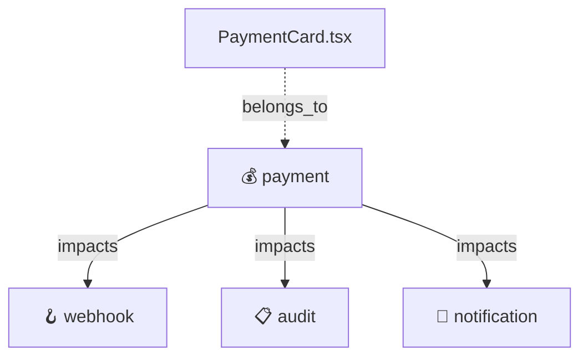

# 05 — Cognitive Graph Layer

📂 [src/knowlyx/graph/](../src/knowlyx/graph/)

NetworkX DiGraph ที่เก็บ relationships ของทุกอย่างใน system

## Files

| File | หน้าที่ |
|---|---|
| `cognitive_graph.py` | สร้าง/query graph + built-in cascade rules |
| `exporter.py` | export เป็น React Flow JSON / Mermaid / DOT |

## Node types

| Kind | ตัวอย่าง |
|---|---|
| `domain` | `payment`, `auth`, `webhook` |
| `component` | `PaymentCard`, `LoginForm` |
| `hook` | `usePaymentStatus`, `useAuth` |
| `util` | `paymentFormatter`, `dateParser` |
| `service` | `PaymentService`, `AuthService` |
| `convention` | `"must use generated client"` |

## Edge types

| Type | ความหมาย |
|---|---|
| `belongs_to` | asset → domain |
| `impacts` | domain → downstream domains (cascade) |
| `enforced_by` | code → convention rule |
| `depends_on` | repo → repo (workspace) |

## Built-in cascade rules

ฝังไว้ใน `cognitive_graph.py` — ใช้แม้ยังไม่มี data:

```text
payment   → webhook, audit, notification, order
auth      → user, audit, notification
order     → payment, inventory, shipping
otp       → auth, notification, audit
webhook   → audit, worker
worker    → queue, audit
```

→ แตะ `payment` รู้เลยว่ากระทบ `webhook + audit + notification + order`

## Graph exporter

| Format | use case |
|---|---|
| `react_flow` | drop-in `<ReactFlow nodes={} edges={} />` สำหรับ Phase 4 UI |
| `mermaid` | paste ใน markdown / GitHub / Notion |
| `dot` | render ด้วย Graphviz (`dot -Tpng graph.dot > graph.png`) |

Node styling อัตโนมัติตาม kind:
- domain = purple
- backend = blue
- frontend = violet
- worker = orange
- critical = drop shadow

## Real-world usage

```bash
# Mermaid (paste ใน Notion / GitHub README)
uv run knowlyx graph mermaid --repo /path/to/repo > arch.mmd

# DOT → PNG
uv run knowlyx graph dot --repo /path/to/repo | dot -Tpng > arch.png

# React Flow JSON (ส่งเข้า frontend)
uv run knowlyx graph react_flow --repo /path/to/repo --json > graph.json
```

**ตัวอย่าง output (Mermaid):**



**Scenario จริง:** Onboarding presentation
- Engineer ใหม่เข้าทีม
- Lead เปิด Notion → embed Mermaid graph ของ payment domain
- เห็น 1 นาทีเข้าใจว่า payment touches อะไรบ้าง
- ไม่ต้องวาด whiteboard
